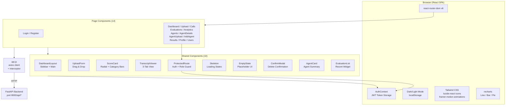
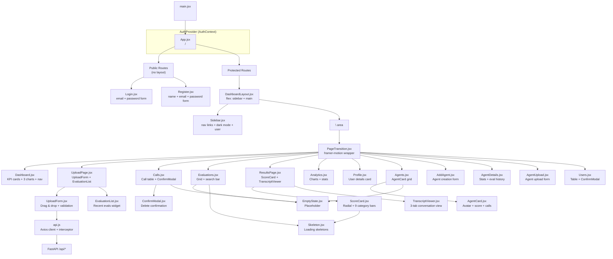
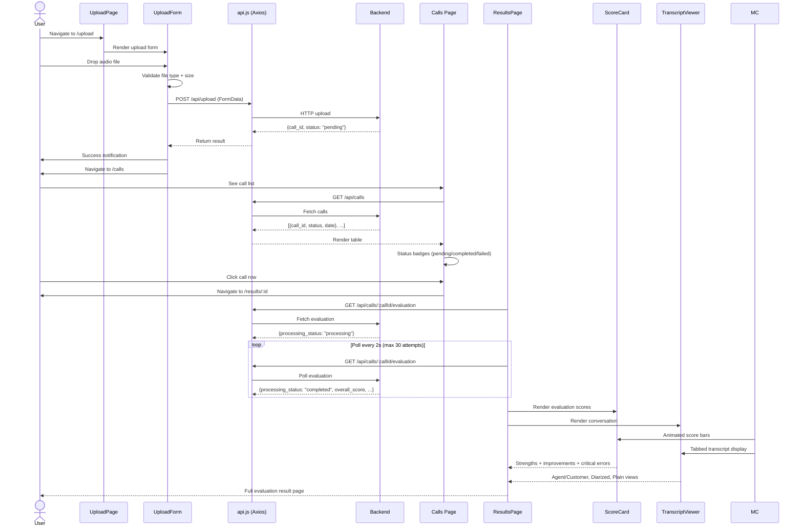
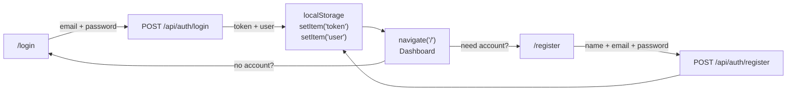
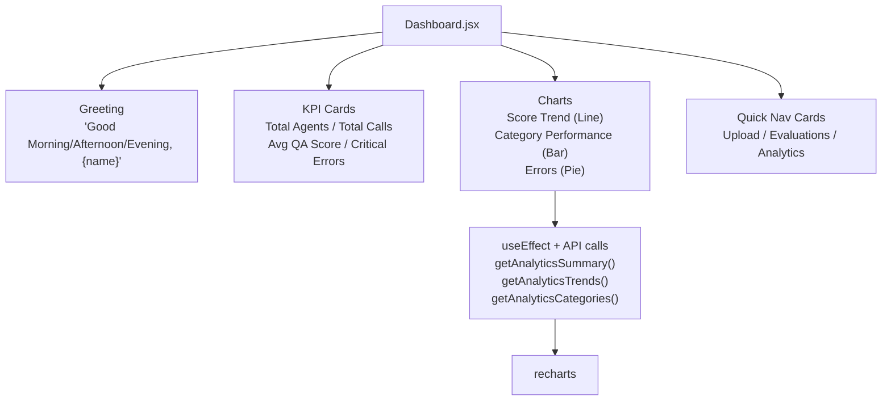
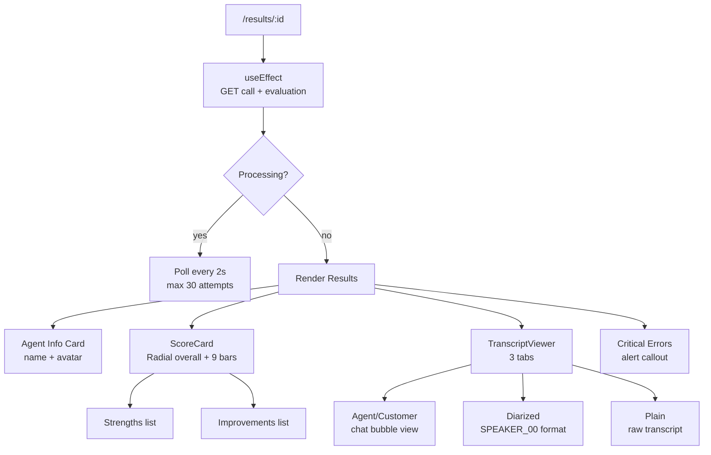

# CallAudit Frontend — AI Call QA Dashboard

React + Vite SPA for uploading call recordings, viewing AI-generated QA evaluations, managing agents, and monitoring analytics.

---

## Architecture Overview



---

## Route Structure

```mermaid
flowchart TD
    APP["App.jsx<br/><BrowserRouter>"] --> PUBLIC["Public Routes"]
    APP --> PRIVATE["Protected Routes<br/><ProtectedRoute + DashboardLayout>"]

    PUBLIC --> LOGIN["/login<br/>Login.jsx"]
    PUBLIC --> REGISTER["/register<br/>Register.jsx"]

    PRIVATE --> DASH["/ (Dashboard)<br/>KPI cards + Charts + Quick nav"]
    PRIVATE --> UPLOAD["/upload<br/>UploadForm + EvaluationList"]
    PRIVATE --> CALLS["/calls<br/>Calls table + status + delete"]
    PRIVATE --> EVALS["/evaluations<br/>Evaluation grid + search"]
    PRIVATE --> RESULT["/results/:id<br/>ScoreCard + TranscriptViewer"]
    PRIVATE --> ANALYTICS["/analytics<br/>Trends + Breakdown + Stats"]
    PRIVATE --> PROFILE["/profile<br/>User details"]

    PRIVATE --> AGENTS["/agents<br/>Agent card grid"]
    PRIVATE --> AGENT_NEW["/agents/new<br/>Add agent form"]
    PRIVATE --> AGENT_ID["/agents/:id<br/>Agent stats + history"]
    PRIVATE --> AGENT_UPLOAD["/agents/:id/upload<br/>Agent upload form"]

    PRIVATE --> USERS["/users<br/>Admin: user table + CRUD"]

    style USERS fill:#fef3c7,stroke:#f59e0b
    style LOGIN fill:#dbeafe,stroke:#3b82f6
    style REGISTER fill:#dbeafe,stroke:#3b82f6
```



---

## Component Tree



---

## Data Flow — Upload to Results



---

## Project Structure

```
frontend/
├── src/
│   ├── main.jsx                    # React entry, <BrowserRouter> + <AuthProvider>
│   ├── App.jsx                     # Route definitions, <AnimatePresence>
│   ├── index.css                   # Tailwind directives + custom layers
│   │
│   ├── context/
│   │   └── AuthContext.jsx         # JWT auth state provider + useAuth hook
│   │
│   ├── layout/
│   │   ├── DashboardLayout.jsx     # Sidebar + main content area wrapper
│   │   ├── Sidebar.jsx             # Navigation, dark mode, user info
│   │   └── Navbar.jsx              # Top header bar (not currently used)
│   │
│   ├── pages/                      # 14 route-level page components
│   │   ├── Login.jsx               # Sign-in form
│   │   ├── Register.jsx            # User registration
│   │   ├── Dashboard.jsx           # KPIs, charts, quick nav
│   │   ├── UploadPage.jsx          # Audio upload + recent evaluations
│   │   ├── Calls.jsx               # Call list table with status
│   │   ├── Evaluations.jsx         # Evaluation grid with search
│   │   ├── ResultsPage.jsx         # Full evaluation detail
│   │   ├── Analytics.jsx           # Trend & category charts
│   │   ├── Agents.jsx              # Agent card grid
│   │   ├── AddAgent.jsx            # Create new agent
│   │   ├── AgentDetails.jsx        # Agent profile + history
│   │   ├── AgentUpload.jsx         # Upload for specific agent
│   │   ├── Users.jsx               # Admin user management
│   │   └── Profile.jsx             # User profile display
│   │
│   ├── components/                 # 10 shared/reusable components
│   │   ├── ProtectedRoute.jsx      # Auth guard + role check
│   │   ├── PageTransition.jsx      # Framer Motion animation wrapper
│   │   ├── UploadForm.jsx          # Drag-and-drop file upload
│   │   ├── ScoreCard.jsx           # Radial + category score display
│   │   ├── TranscriptViewer.jsx    # 3-tab conversation viewer
│   │   ├── AgentCard.jsx           # Clickable agent summary card
│   │   ├── EvaluationList.jsx      # Recent evaluations widget
│   │   ├── ConfirmModal.jsx        # Animated confirmation dialog
│   │   ├── Skeleton.jsx            # Card, Table, Eval loading states
│   │   └── EmptyState.jsx          # Empty list placeholder
│   │
│   └── services/
│       └── api.js                  # Axios client, 21 endpoint functions
│
├── index.html                      # Vite entry HTML
├── package.json                    # Dependencies & scripts
├── vite.config.js                  # Dev proxy /api -> localhost:8000
├── tailwind.config.js              # Custom theme, dark mode class
├── postcss.config.js               # PostCSS + Tailwind + Autoprefixer
├── nginx.conf                      # Docker nginx config (SPA + API proxy)
├── Dockerfile                      # Multi-stage build (Node -> nginx)
└── .env.example                    # VITE_API_URL
```

---

## Technology Stack

| Layer | Technology | Purpose |
|-------|-----------|---------|
| **Framework** | React 18.3 | UI component library |
| **Build** | Vite 5.4 | Dev server + optimized builds |
| **Routing** | react-router-dom 6.26 | SPA client-side routing |
| **Styling** | Tailwind CSS 3.4 | Utility-first CSS, dark mode |
| **Icons** | lucide-react | SVG icon library |
| **Charts** | recharts 2.12 | Line, Bar, Pie charts |
| **Animations** | framer-motion 12.40 | Page transitions, staggered lists |
| **HTTP** | axios 1.7 | API client + auth interceptor |
| **Auth** | JWT (localStorage) | Bearer token management |

---

## Features

- **Dashboard** — KPI cards (agents, calls, avg score, critical errors), score trend line chart, category bar chart, clean vs critical error pie chart
- **Upload** — Drag-and-drop audio upload with file validation, recent evaluations widget
- **Calls** — Table view with color-coded processing status badges, admin delete
- **Evaluations** — Searchable grid with score previews, strengths, improvements
- **Results** — Radial overall score, 9 animated category bars, strengths/improvements, critical error alerts, 3-tab transcript viewer
- **Analytics** — Score trends over time, per-category breakdown, error stats
- **Agents** — Card grid with agent scores, create form, detail page with evaluation history
- **Agent Upload** — Upload call audio linked to a specific agent
- **Users** (Admin) — User table with create/delete, role assignment
- **Profile** — Authenticated user details
- **Theme** — Dark/light mode toggle, persisted to localStorage
- **Auth** — JWT-based, ProtectedRoute with role-based access control
- **Responsive** — Mobile hamburger toggle, static sidebar on desktop

---

## Page Views

### Login / Register



### Dashboard



### Evaluation Results



---

## Components

| Component | Props | Description |
|-----------|-------|-------------|
| `ProtectedRoute` | `children, roles?` | Auth guard: redirects to `/login` if not authenticated, to `/` if unauthorized role |
| `PageTransition` | `children` | Framer Motion fade + slide-up wrapper for page content |
| `UploadForm` | — | Drag-and-drop zone, file validation (.wav/.mp3/.m4a), remove button, loading spinner |
| `ScoreCard` | `evaluation` | Radial progress (overall score), 9 animated bar charts, strengths/improvements lists |
| `TranscriptViewer` | `conversation?`, `transcript?` | Tabbed: Agent/Customer chat, Diarized text, Plain text |
| `AgentCard` | `agent` | Clickable card with avatar initial, name, dept, avg score, total calls |
| `EvaluationList` | — | Fetches 5 most recent evaluations, shows score + date, navigates to result |
| `ConfirmModal` | `isOpen, onClose, onConfirm, title, message` | Animated confirmation overlay |
| `Skeleton` | — | `CardSkeleton`, `TableSkeleton`, `EvalSkeleton` |
| `EmptyState` | `icon, title, description, buttonText?, onAction?` | Empty list placeholder |

---

## API Service Layer

All 21 backend endpoints are accessible through `src/services/api.js`. The Axios instance:

```mermaid
flowchart LR
    A["api.js"] --> B["axios.create()<br/>baseURL: VITE_API_URL"]
    B --> C["Request Interceptor<br/>Attach Bearer token"]
    B --> D["Response Interceptor<br/>401 → logout + redirect"]

    C --> E["GET /api/auth/me"]
    C --> F["POST /api/auth/login"]
    C --> G["POST /api/auth/register"]
    C --> H["POST /api/upload"]
    C --> I["POST /api/evaluate/:id"]
    C --> J["GET /api/evaluations"]
    C --> K["GET /api/calls"]
    C --> L["GET /api/analytics/*"]
    C --> M["GET/POST/DELETE /api/agents/*"]
    C --> N["GET/POST/DELETE /api/users/*"]
```



---

## Environment Variables

| Variable | Default | Description |
|----------|---------|-------------|
| `VITE_API_URL` | `""` (empty) | Backend API base URL. In dev, uses Vite proxy. In Docker/nginx, proxied at `/api/`. |

---

## Quick Start

```bash
# 1. Enter frontend
cd frontend

# 2. Install dependencies
npm install

# 3. Start dev server (API proxy -> localhost:8000)
npm run dev

# Open http://localhost:5173
```

### Docker

```bash
# From project root
docker compose up -d
# Frontend served at http://localhost:3000
```

### Build for Production

```bash
npm run build
npm run preview    # Preview at http://localhost:4173
```

---

## Theming

Dark mode uses Tailwind's `class` strategy. Toggled via `Sidebar` component, persisted to `localStorage` under key `theme`. Applied by adding/removing `.dark` class on `<html>` element.

```js
// tailwind.config.js
darkMode: 'class'
```

---

## Development Proxy

In `vite.config.js`, the dev server proxies `/api` requests to the backend:

```js
server: {
  proxy: {
    '/api': 'http://localhost:8000'
  }
}
```

This means in development the frontend can use relative paths (`/api/upload`), while production nginx handles the same proxy.
